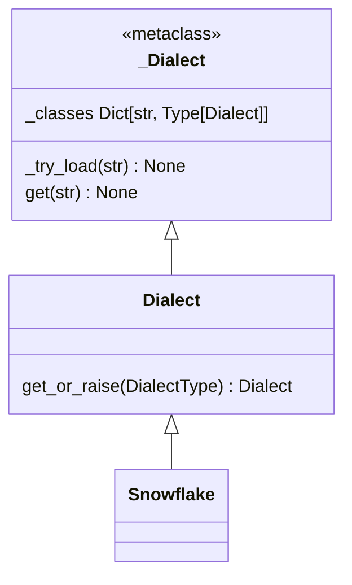

# sqlglot/__init__.py
- tokenize(sql: str, read: DialectType = None, dialect: DialectType = None) -> t.List[Token]
- parse(sql: str, read: DialectType = None, dialect: DialectType = None, **opts) -> t.List[t.Optional[Expression]]
- parse_one(sql: str, read: DialectType = None, dialect: DialectType = None, into: t.Optional[exp.IntoType] = None, **opts) -> Expression
- transpile(sql: str, read: DialectType = None, write: DialectType = None, identity: bool = True, error_level: t.Optional[ErrorLevel] = None, **opts) -> t.List[str]

# tokenize(sql: str, read: DialectType = None, dialect: DialectType = None) -> t.List[Token]
- 指定された SQL 文字列をトークン化します。
- 引数
    - sql: トークン化する SQL コード文字列。
    - read: トークン化中に適用する SQL 方言
    - dialect: SQL 方言 (read の別名)。
- 戻り: 結果として得られるトークンのリスト。

## (sqlglot.dialects.dialect.)Dialect.get_or_raise(cls, dialect: DialectType) -> Dialect:
- dialect が文字列でなければ、そのオブジェクト。文字列なら get
### (sqlglot.dialects.dialect.)_Dialect.get(cls, key: str, default: t.Optional[t.Type[Dialect]] = None) -> t.Optional[t.Type[Dialect]]
- sqlglot.dialects の下の同名ファイルで定義された Dialect を返す
- ここの初期化はスーパークラス _Dialect の __new__ を通じて、クラス変数辞書キャッシュ _classes に格納される

